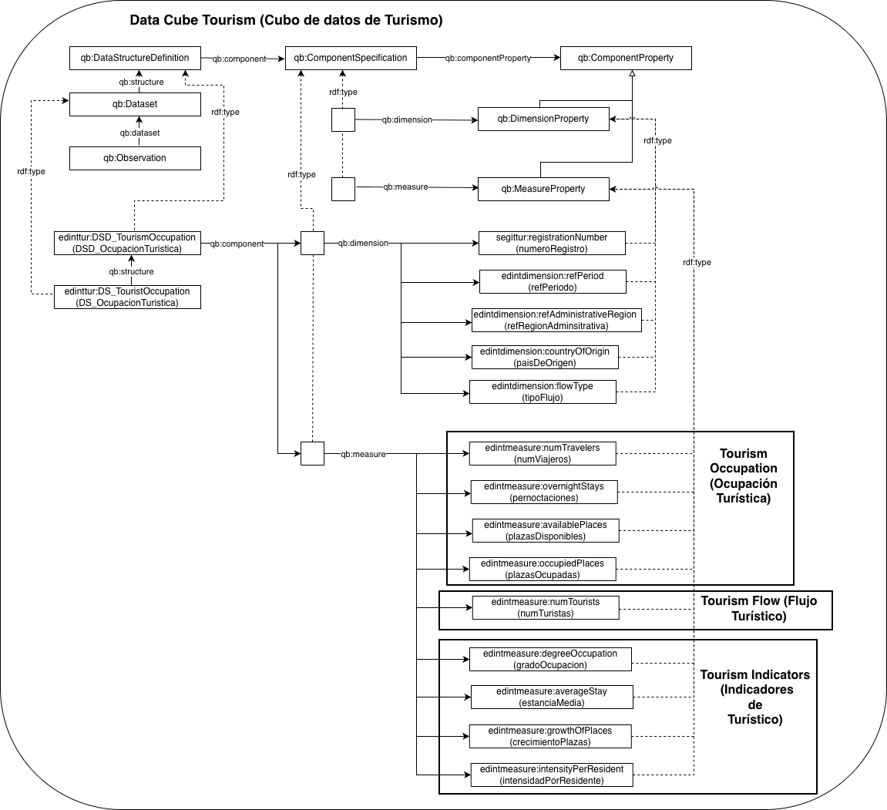

# Cubo de datos EDINT de Turismo (EDINT Tourism Data Cube)

Este recurso define una **ontología de cubos de datos turísticos** para representar de forma estructurada distintos conjuntos de datos relacionados con el turismo, incluyendo **ocupación turística**, **flujo turístico** e **indicadores turísticos**. El modelo se basa en el vocabulario **W3C RDF Data Cube** , lo que permite describir dimensiones, medidas y estructuras de datos de forma interoperable, reutilizable y preparada para su explotación en entornos semánticos.

Este cubo de datos está siendo desarrollado en el contexto del Espacio de Datos para las Infraestructuras Urbanas Inteligentes ([EDINT](https://edint.es/)).

# Propósito y alcance del cubo de datos (Purpose and scope of the data cube)

El cubo de datos turísticos se ha diseñado para modelar datos estadísticos del ámbito del turismo de manera unificada, permitiendo describir observaciones según diferentes ejes de análisis, como el territorio, el periodo temporal, el país de origen de los turistas, el tipo de flujo turístico o el número de registro del establecimiento turístico.

El vocabulario reutiliza y extiende términos procedentes de estándares y recursos como **[RDF Data Cube](https://www.w3.org/TR/vocab-data-cube/)**, **[SDMX](https://sdmx.org/)**, **[Time Ontology](https://www.w3.org/TR/owl-time/)**, clasificaciones SKOS y vocabularios de administración pública, con el objetivo de favorecer la interoperabilidad con otros conjuntos de datos y modelos estadísticos.

El cubo incluye las siguientes dimensiones:

* **Región administrativa de referencia** (`edintdimension:refAdminRegion`): Permite indicar el ámbito territorial al que se refiere la observación. Puede corresponder, por ejemplo, a un  **barrio** , **distrito** o  **municipio** .
* **Periodo de referencia** (`edintdimension:refPeriod`): Indica el intervalo temporal de la observación, por ejemplo una semana, un mes o un año.
* **País de origen** (`edintdimension:countryOfOrigin`): Representa el país de origen del turista. Se modela como una dimensión codificada basada en un esquema de conceptos SKOS.
* **Tipo de flujo turístico** (`edintdimension:flowType`): Permite clasificar el flujo turístico, por ejemplo como turismo de entrada, de salida o interno. También se modela como dimensión codificada.
* **Número de registro** (`edintdimension:registrationNumber`): Identifica el número de registro del establecimiento turístico, por ejemplo según el registro de Segittur.

Y define las siguientes medidas estadísticas:

1. Para representar la **ocupación turística**:

* `edintmeasure:averageStay` — estancia media
* `edintmeasure:degreeOccupation` — grado de ocupación
* `edintmeasure:growthOfPlaces` — crecimiento de plazas
* `edintmeasure:intensityPerResident` — intensidad por residente

2. Para representar el **flujo turístico**:

* `edintmeasure:numTourists` — número de turistas

3. Para representar **indicadores generales de turismo**:

* `edintmeasure:availablePlaces` — plazas disponibles
* `edintmeasure:numTravelers` — número de viajeros
* `edintmeasure:occupiedPlaces` — plazas ocupadas
*  `edintmeasure:overnightStays` — pernoctaciones

# Prefijo y espacio de nombres (Prefix and namespace)

El prefijo del cubo de datos es: edintgast y se encuentra publicada en el espacio de nombres: **[http://vocab.linkeddata.es/datosabiertos/def/turismo/cubo-turismo#]()**

Las dimensiones se representan con el prefijo **edintdimension** y se encuentra en el espacio de nombres: **[http://vocab.linkeddata.es/datosabiertos/def/dimension#](http://vocab.linkeddata.es/datosabiertos/def/dimension#)**

Las medidas se representan con el prefijo **edintmeasure** y se encuentre en el espacio de nombres: **[http://vocab.linkeddata.es/datosabiertos/def/measure#](http://vocab.linkeddata.es/datosabiertos/def/measure#)**

# Modelo conceptual (Data Cube conceptualization)

# Estructura del repositorio (Repository structure)

El repositorio debe contener (al menos) las siguientes carpetas

| Carpeta                       | Descripción                                                                                                                                        |
| ----------------------------- | --------------------------------------------------------------------------------------------------------------------------------------------------- |
| **diagrams/**           | Contiene diagramas y otros recursos que representan el modelo conceptual del cubo de datos (por ejemplo, las dimensiones y las medidas).           |
| **documentation/**      | Contiene la documentación del cubo de datos y artefactos relacionados en formato HTML o dirigida a usuarios.                                       |
| **tests/**              | Contiene las pruebas para la evaluación del cubo de datos.                                                                                         |
| **kos/**                | Contiene la implementación de vocabularios controlados o KOS, generalmente implementaciones SKOS en RDF.                                           |
| **data-cube-ontology/** | Contiene los archivos de implementación del cubo de datos en formatos como .owl .                                                                  |
| **requirements/**       | Contiene todos los documentos utilizados para definir los requisitos del cubo de datos: preguntas de competencia y sus respectivas SPARQL queries. |

# Mantenimiento y evolución (Maintenance and evolution)

Para manejar las incidencias o mejoras sugeridas con respecto al cubo de datos, recomendamos seguir las guías proporcionadas en ([Issues Management](./ISSUES.md)) para generar una incidencia.

# Financiación (Funding)

Este cubo de datos ha sido desarrollado en el contexto del Espacio de Datos para las Infraestructuras Urbanas Inteligentes ([EDINT](https://edint.es)).

